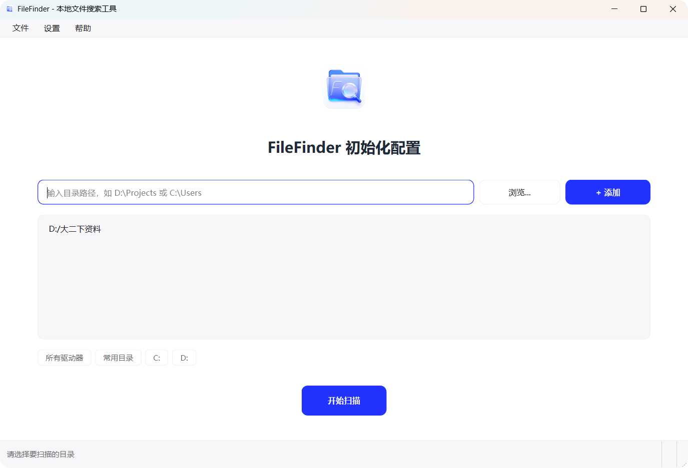
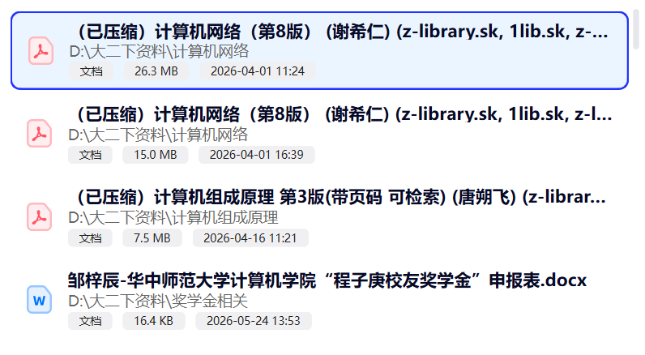
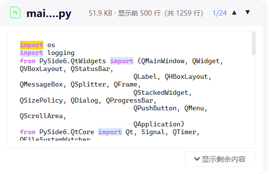

<div align="center">


# FileFinder

**一款轻量级的本地文件搜索桌面工具**

帮助用户通过文件名或文件内容快速定位电脑中的文件

[](https://github.com/ZiChen-Whisper/FileFinder)
[](https://www.python.org/)
[](https://www.microsoft.com/windows)
[](https://doc.qt.io/qtforpython-6/)
[](LICENSE)

[🌐 GitHub](https://github.com/ZiChen-Whisper/FileFinder) · [📧 联系作者](mailto:3331879873@qq.com) · [📖 项目文档](docs/index.html)

</div>

---

## 功能特性

### 🔍 多模式文件名搜索

| 模式 | 说明 | 示例 |
|------|------|------|
| 模糊匹配 | 子串包含，最常用的搜索方式 | `readme` → 匹配所有包含 readme 的文件 |
| 精确匹配 | 完全相等 | `main.py` → 只返回 main.py |
| 通配符匹配 | 支持 `*` 和 `?` | `*.py` → 返回所有 Python 文件 |
| 正则匹配 | 正则表达式 | `test_\d+` → 匹配 test_1, test_2 等 |

搜索结果按相关度评分排序：精确匹配 > 前缀匹配 > 词边界匹配 > 子串匹配。

### 📄 文件内容搜索

- **纯文本/代码文件**：多线程并发搜索，支持大小写敏感/不敏感
- **PDF 文件**：使用 PyMuPDF 逐页搜索，C 级别快速匹配
- **Word 文档**：提取段落和表格中的文字内容
- **Excel 文件**：提取所有工作表中的单元格内容
- **PPT 文件**：提取幻灯片中的文字和表格内容
- **FTS5 全文索引**：优先使用 SQLite FTS5 索引搜索，毫秒级响应；无索引时回退到实时扫描

### 🔗 联合搜索

同时输入文件名和内容关键词，取交集返回同时满足两个条件的结果。

### 🗂 磁盘扫描索引

- SQLite 持久化索引，一次扫描终生复用
- 内存缓存（SearchCache），启动时全表加载，搜索零 IO
- WAL 模式 + PRAGMA 优化（16MB 缓存 + 64MB 内存映射）
- 批量写入（500 条/批 commit）
- 文件系统监控（QFileSystemWatcher），自动增量同步索引

### 👁 内容预览 + 高亮

| 文件类型 | 预览能力 |
|---------|---------|
| 文本/代码 | 语法高亮（Python/JS/Markdown/JSON/通用代码） |
| 图片 | 缩放、拖拽浏览 |
| PDF | 页面渲染，支持缩放和翻页 |
| Excel | 表格展示，支持 Sheet 切换 |
| Markdown | 渲染预览 / 源码切换 |
| HTML | 内嵌渲染预览 |
| 视频/音频 | 系统播放器预览 |
| 压缩包 | 列出压缩包内文件列表 |
| 文件夹 | 列出目录内容 |

搜索关键词在预览中自动高亮标记。

### 🎛 筛选与排序

- **9 大分类筛选**：文档、代码、图片、视频、音频、压缩包等，每个分类下有子分类
- **多种排序方式**：按相关度、名称、修改时间、文件大小排序，支持升降序切换
- **搜索范围选择**：树形目录选择器，精确控制搜索范围

## 截图

| 初始化配置 | 扫描进度 |
|:---:|:---:|
|  |  |

| 主界面 | 搜索结果 |
|:---:|:---:|
|  |  |

| 搜索栏 | 筛选栏 |
|:---:|:---:|
|  |  |

| 预览面板 | 代码预览 |
|:---:|:---:|
|  |  |

## 技术栈

| 层级 | 技术 | 说明 |
|------|------|------|
| GUI 框架 | PySide6 | Qt for Python 桌面应用 |
| 编程语言 | Python 3.10+ | 后端业务逻辑 |
| 数据库 | SQLite 3 | 本地数据存储 + FTS5 全文索引 + 内存缓存 |
| 文档预览 | PyMuPDF / openpyxl / markdown | PDF/Excel/Markdown 渲染 |
| 文档解析 | python-docx / python-pptx | Word/PPT 内容提取 |
| 中文分词 | jieba | FTS5 索引分词 |
| 编码检测 | charset-normalizer | 自动检测文件编码 |
| 样式系统 | style_constants + style_manager | 集中化样式令牌 + QSS 生成 |

## 项目结构

```
filefinder/
├── main.py                    # 程序入口
├── config.py                  # 配置管理（JSON 文件读写 + 扫描状态管理）
├── constants.py               # 常量定义（扩展名分类、窗口尺寸、性能参数等）
├── requirements.txt           # 依赖清单
│
├── models/                    # 数据模型层
│   ├── file_item.py           # FileItem 数据类
│   ├── search_query.py        # SearchQuery 数据类
│   ├── search_result.py       # SearchResult / ContentMatch 数据类
│   └── search_history.py      # SearchHistory 数据类
│
├── core/                      # 核心业务逻辑层
│   ├── name_searcher.py       # 文件名搜索（模糊/精确/通配符/正则 + 评分）
│   ├── content_searcher.py    # 内容搜索（FTS5 索引 + 实时扫描 + 多线程）
│   ├── file_parser.py         # 文件解析（注册表模式：Text/PDF/Word/Excel/PPT）
│   ├── search_engine.py       # 搜索调度引擎（联合搜索 + 排序）
│   ├── scan_worker.py         # 磁盘扫描工作线程
│   └── search_worker.py       # 搜索工作线程
│
├── ui/                        # 用户界面层
│   ├── main_window.py         # 主窗口
│   ├── style_constants.py     # 样式令牌（颜色/字号/圆角/间距/图标映射）
│   ├── style_manager.py       # QSS 样式生成
│   ├── modern_dialog.py       # 现代化对话框基类
│   ├── pages/                 # 页面组件
│   │   ├── welcome_page.py    # 欢迎页
│   │   └── scan_progress.py   # 扫描进度页
│   ├── widgets/               # UI 组件
│   │   ├── search_bar.py      # 搜索栏（防抖 + 4 种匹配模式）
│   │   ├── result_list.py     # 结果列表（分批渲染 + 加载更多 + 拖拽）
│   │   ├── filter_bar.py      # 筛选栏（9 大分类 + 子分类 + 排序）
│   │   ├── preview_panel.py   # 预览面板（多格式预览 + 高亮）
│   │   ├── rounded_menu.py    # 圆角右键菜单
│   │   ├── animated_radio_button.py  # 动画单选按钮
│   │   ├── common_widgets.py  # 公共组件
│   │   └── search_scope_panel.py     # 搜索范围面板
│   └── dialogs/               # 对话框
│       ├── settings_dialog.py # 设置对话框
│       ├── about_dialog.py    # 关于对话框
│       └── scope_selection_dialog.py  # 范围选择对话框
│
├── utils/                     # 工具函数
│   ├── encoding.py            # 编码检测 + 文本文件读取
│   ├── path_helper.py         # 路径工具（规范化/二进制检测/排除判断）
│   ├── thread_helper.py       # 防抖器（Debouncer）
│   ├── flow_layout.py         # 流式布局
│   └── tokenizer.py           # jieba 分词器（FTS5 索引用）
│
├── database/                  # 数据访问层
│   ├── db_manager.py          # 数据库管理器（单例 + 内存缓存 + FTS5 索引）
│   ├── history_dao.py         # 搜索历史 DAO
│   └── settings_dao.py        # 设置 DAO
│
├── icons/                     # 图标资源
│   └── doctype/               # 文件类型图标（SVG，60+ 种）
│
└── docs/                      # 文档和截图
    └── screenshot/            # 界面截图
```

## 快速开始

### 环境要求

- Python 3.10 或更高版本
- Windows 10/11

### 安装依赖

```bash
pip install -r requirements.txt
```

### 运行程序

```bash
python main.py
```

### 首次使用

1. 启动后进入欢迎页，选择要索引的磁盘或目录
2. 等待扫描完成（首次扫描需要遍历所有文件，后续增量同步）
3. 在搜索栏输入关键词开始搜索

## 性能参数

| 指标 | 默认值 | 说明 |
|------|--------|------|
| 搜索防抖 | 300ms | 输入后延迟搜索，减少无效请求 |
| 内容搜索线程数 | 4-8 | 根据 CPU 核心数自动调整 |
| 单文件大小限制 | 10MB | 超过此大小的文件跳过内容搜索 |
| 最大搜索结果 | 1000 条 | 截断返回 |
| 分批渲染 | 50 条/批 | UI 分批添加结果项 |
| 初始显示 | 200 条 | 结果列表初始显示条数 |
| 数据库批量写入 | 500 条/批 | 批量 commit 减少磁盘 IO |

## 支持的文件类型

| 分类 | 扩展名 |
|------|--------|
| 文本 | .txt .md .log .csv .xml .yaml .yml .ini .cfg .conf .toml .env |
| 代码 | .py .js .ts .html .css .java .c .cpp .h .go .rs .rb .php .sh .bat .ps1 .sql .json |
| 文档 | .pdf .docx .xlsx .pptx .rtf .epub |
| 图片 | .jpg .jpeg .png .gif .bmp .tiff .svg .ico |
| 视频 | .mp4 .mkv .avi .mov .wmv .flv |
| 音频 | .mp3 .wav .flac .aac .ogg .wma |
| 压缩包 | .zip .rar .7z .tar .gz .bz2 .xz |

## 依赖清单

| 库 | 版本要求 | 用途 |
|----|---------|------|
| PySide6 | >= 6.5.0 | GUI 框架 |
| PyMuPDF | >= 1.23.0 | PDF 预览和内容搜索 |
| python-docx | >= 0.8.11 | Word 文档解析 |
| openpyxl | >= 3.1.0 | Excel 文件解析和预览 |
| python-pptx | >= 0.6.21 | PPT 文件解析 |
| charset-normalizer | >= 3.0.0 | 文件编码自动检测 |
| markdown | >= 3.4.0 | Markdown 渲染预览 |
| jieba | >= 0.42.1 | 中文分词（FTS5 索引） |

## 许可证

本项目基于 [MIT License](LICENSE) 开源。

---

<div align="center">

**FileFinder** © 2025 - Present by [ZiChen-Whisper](https://github.com/ZiChen-Whisper)

</div>
